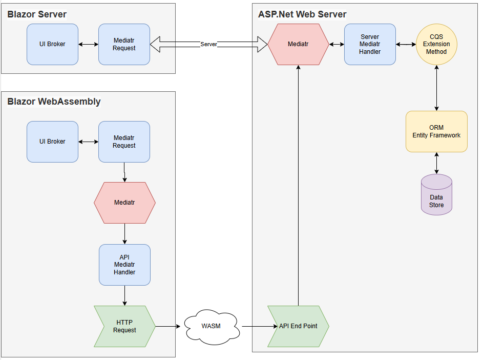

# An Introduction to Antimony

Antimony is my implementation of the CQS pattern in DotNetCore. It is a simple library that provides the building blocks for implementing the CQS and Mediator patterns in your application.

The diagram below shows the basic structure and data flows for Blazor Server and WebAssembly applications.

In Blazor Server, the Hub session dispatches requests directly to the server-side Mediatr service and the reqiestered Entity Framework handlers.

In Blazor WebAssembly, the hub session dispatches the requests to the local client-side Mediator service.  This has API based registered handlers which call API endpoints with the specific Mediatr requests.  The endpoints dispatch the requests to the Entity Framework server-side handlers.



## The Backend Pipelines

There are three CQS pipelines.

### Record Queries

The record query pipeline is used to retrieve a single record from the database. It is a read-only pipeline that does not modify the database.

The `RecordQueryRequest` defines the query to be executed.

```csharp
public record RecordQueryRequest<TRecord>(Expression<Func<TRecord, bool>> FindExpression, CancellationToken? Cancellation = null);
```

And the execute method is defined as follows.  Note:

1. It disables tracking on the `DbContext` as it's readonly.
2. It uses the provided predicate expression in `FirstOrDefaultAsync`.
3. Sets `ConfigureAwait` to false to let the caller decide where the continuation runs.  This is backend code and not concerned with the UI thread.
4. Returns a `Result<TRecord>`.  

```csharp
public static async ValueTask<Result<TRecord>> GetRecordAsync<TRecord>(TDbContext dbContext, RecordQueryRequest<TRecord> request)
    where TRecord : class
{
    dbContext.ChangeTracker.QueryTrackingBehavior = QueryTrackingBehavior.NoTracking;

    var record = await dbContext.Set<TRecord>()
        .FirstOrDefaultAsync(request.FindExpression)
        .ConfigureAwait(false);

    if (record is null)
        return Result<TRecord>.Fail(new RecordQueryException($"No record retrieved with the Key provided"));

    return Result<TRecord>.Success(record);
}
```

This is added to the `DbContext` as an extension method:

```csharp
public static async ValueTask<Result<TRecord>> GetRecordAsync<TRecord>(this DbContext dbContext, RecordQueryRequest<TRecord> request)
    where TRecord : class
{
    return await DbBroker<DbContext>.GetRecordAsync(dbContext, request);
}
```
 
### List Queries

The list query request is a little more complex because we need to cater for paging, sorting and filtering.

```csharp
public record ListQueryRequest<TRecord>
{
    public int StartIndex { get; init; }
    public int PageSize { get; init; }
    public CancellationToken Cancellation { get; init; }
    public Expression<Func<TRecord, bool>>? FilterExpression { get; init; }
    public Expression<Func<TRecord, object>>? SortExpression { get; init; }
    public bool SortDescending { get; init; } = true;

    public ListQueryRequest()
    {
        StartIndex = 0;
        PageSize = 1000;
        Cancellation = new();
        FilterExpression = null;
        SortExpression = null;
    }
}
```

The execute method:

1. Disables tracking on the `DbContext`.
1. Builds an `IQueryable` instance for the `TRecord` type.
1. Applies the filter expression if one is provided.
1. Gets the total record count after applying the filters.
1. Applies the sort expression if one is provided.
1. Applies paging to the filtered and sorted `IQueryable`.
1. Finally materializes the list from the data source. 

```csharp
public static async ValueTask<Result<ListItemsProvider<TRecord>>> GetItemsAsync<TRecord>(TDbContext dbContext, ListQueryRequest<TRecord> request)
    where TRecord : class
{
    int totalRecordCount;

    // Turn off tracking.  We're only querying, no changes
    dbContext.ChangeTracker.QueryTrackingBehavior = QueryTrackingBehavior.NoTracking;

    // Get the IQueryable DbSet for TRecord
    IQueryable<TRecord> query = dbContext.Set<TRecord>();

    // If we have a filter defined, apply the predicate delegate to the IQueryable instance
    if (request.FilterExpression is not null)
        query = query.Where(request.FilterExpression).AsQueryable();

    // Get the total record count after applying the filters
    totalRecordCount = query is IAsyncEnumerable<TRecord>
        ? await query.CountAsync(request.Cancellation).ConfigureAwait(ConfigureAwaitOptions.None)
        : query.Count();

    // If we have a sorter, apply the sorter to the IQueryable instance
    if (request.SortExpression is not null)
    {
        query = request.SortDescending
            ? query.OrderByDescending(request.SortExpression)
            : query.OrderBy(request.SortExpression);
    }

    // Apply paging to the filtered and sorted IQueryable
    if (request.PageSize > 0)
        query = query
            .Skip(request.StartIndex)
            .Take(request.PageSize);

    // Finally materialize the list from the data source
    var list = query is IAsyncEnumerable<TRecord>
        ? await query.ToListAsync().ConfigureAwait(ConfigureAwaitOptions.None)
        : query.ToList();

    return Result<ListItemsProvider<TRecord>>.Success(new(list, totalRecordCount));
}
```

The `ListItemsProvider` returned by `Result<T>` is:

```csharp
public record ListItemsProvider<TRecord>(IEnumerable<TRecord> Items, int TotalCount);
```

The `DbContext` as an extension method:

```csharp
    public static async ValueTask<Result<ListItemsProvider<TRecord>>> GetItemsAsync<TRecord>(this DbContext dbContext, ListQueryRequest<TRecord> request)
    where TRecord : class
    {
        return await DbBroker<DbContext>.GetItemsAsync(dbContext, request);
    }
```

### Commands

The command pipeline is used to modify records in the data store.  The `CommandRequest` is defined as:

```csharp
public record CommandRequest<TRecord>(TRecord Item, CommandState State );s
```

CommandState defines the command state i.e. *Create/Update/Delete*:

```csharp
public readonly record struct CommandState
{
    public const int StateNone = 0;
    public const int StateAdd = 1;
    public const int StateUpdate = 2;
    public const int StateDelete = -1;

    public int Index { get; private init; } = 0;
    public string Value { get; private init; } = "None";

    public CommandState() { }

    private CommandState(int index, string value)
    {
        Index = index;
        Value = value;
    }

    public override string ToString()
    {
        return this.Value;
    }

    public CommandState AsDirty
        => this.Index == 0 ? CommandState.Update : this;

    public static CommandState None = new CommandState(StateNone, "None");
    public static CommandState Add = new CommandState(StateAdd, "Add");
    public static CommandState Update = new CommandState(StateUpdate, "Update");
    public static CommandState Delete = new CommandState(StateDelete, "Delete");

    public static CommandState GetState(int index)
        => (index) switch
        {
            StateAdd => CommandState.Add,
            StateUpdate => CommandState.Update,
            StateDelete => CommandState.Delete,
            _ => CommandState.None,
        };
}
```

The execute method.  Note it returns a `Result<TRecord>`, where `TRecord` is the updated record.  The calling may need to know the identity of an added record.

```csharp
public static async ValueTask<Result<TRecord>> ExecuteCommandAsync<TRecord>(TDbContext dbContext, CommandRequest<TRecord> request, CancellationToken cancellationToken = new())
    where TRecord : class
{
    if ((request.Item is not ICommandEntity))
        return Result<TRecord>.Fail(new CommandException($"{request.Item.GetType().Name} Does not implement ICommandEntity and therefore you can't Update/Add/Delete it directly."));

    var stateRecord = request.Item;
    var result = 0;

    switch (request.State.Index)
    {
        case CommandState.StateAdd:
            dbContext.Add<TRecord>(request.Item);
            result = await dbContext.SaveChangesAsync(cancellationToken).ConfigureAwait(ConfigureAwaitOptions.None);

            return result == 1
                ? Result<TRecord>.Success(request.Item)
                : Result<TRecord>.Fail(new CommandException("Error adding Record"));

        case CommandState.StateDelete:
            dbContext.Remove<TRecord>(request.Item);
            result = await dbContext.SaveChangesAsync(cancellationToken).ConfigureAwait(ConfigureAwaitOptions.None);

            return result == 1
                ? Result<TRecord>.Success(request.Item)
                : Result<TRecord>.Fail(new CommandException("Error deleting Record"));

        case CommandState.StateUpdate:
            dbContext.Update<TRecord>(request.Item);
            result = await dbContext.SaveChangesAsync(cancellationToken).ConfigureAwait(ConfigureAwaitOptions.None);

            return result == 1
                ? Result<TRecord>.Success(request.Item)
                : Result<TRecord>.Fail(new CommandException("Error saving Record"));

        default:
            return Result<TRecord>.Fail(new CommandException("Nothing executed.  Unrecognised State."));
    }
}
```

The `DbContext` extension method:

```csharp
    public static async ValueTask<Result<TRecord>> ExecuteCommandAsync<TRecord>(this DbContext dbContext, CommandRequest<TRecord> request, CancellationToken cancellationToken = new())
    where TRecord : class
    {
        return await DbBroker<DbContext>.ExecuteCommandAsync(dbContext, request, cancellationToken);
    }
```

## Integrating with the Mediator Pattern

The demo app uses the Weather Forecast example from the Microsoft documentation. within the app, the `WeatherForecast` domain entity is defined as below.  Ignore the owner fields, they are part of the authentication demo.

```csharp
public sealed record DmoWeatherForecast : ICommandEntity
{
    public WeatherForecastId Id { get; init; } = new(Guid.Empty);
    public IdentityId OwnerId { get; init; } = new(Guid.Empty);
    public string Owner { get; init; } = string.Empty;
    public Date Date { get; init; }
    public Temperature Temperature { get; set; }
    public string Summary { get; set; } = "Not Defined";
}
```

We can create Mediatr requests for the `RecordRequest`, `ListRequest` and `CommandRequest`.  I'll just cover the `RecordRequest` here:

The request object is simple, just containing the identity field `WeatherForecastId`:

```csharp
public readonly record struct WeatherForecastRecordRequest(WeatherForecastId Id) 
    : IRequest<Result<DmoWeatherForecast>>;
```

The handler:

1. Creates a *unit of work* `DbContext` from the factory.
1. Creates the predicate expression for finding the record.
1. Calls the `GetRecordAsync` extension method on the `DbContext`.
1. Converts the data store DTO record to the domain entity.
1. Returns the result as a `Result<DmoWeatherForecast>`.
 
```csharp
public sealed class WeatherForecastRecordHandler : IRequestHandler<WeatherForecastRecordRequest, Result<DmoWeatherForecast>>
{
    private IDbContextFactory<InMemoryWeatherTestDbContext> _factory;

    public WeatherForecastRecordHandler(IDbContextFactory<InMemoryWeatherTestDbContext> dbContextFactory)
    {
        _factory = dbContextFactory;
    }

    public async Task<Result<DmoWeatherForecast>> Handle(WeatherForecastRecordRequest request, CancellationToken cancellationToken)
    {
        using var dbContext = _factory.CreateDbContext();

        Expression<Func<DvoWeatherForecast, bool>> findExpression = (item) =>
            item.WeatherForecastID == request.Id.Value;

        var query = new RecordQueryRequest<DvoWeatherForecast>(findExpression);

        var result = await dbContext.GetRecordAsync<DvoWeatherForecast>(query);

        if (result.HasNotSucceeded(out DvoWeatherForecast? record))
            return result.ConvertFail<DmoWeatherForecast>();

        var returnItem = WeatherForecastMap.Map(record);

        return Result<DmoWeatherForecast>.Success(returnItem);
    }
}
```

So, from the front end you can simply call:

```csharp
Task<Result<DmoWeatherForecast>> result = _mediator.Send(new WeatherForecastRecordRequest(id))
```


